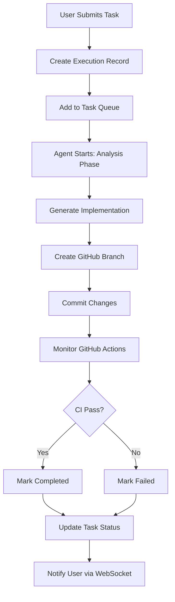

# AI Agent Integration Guide

## Overview

The Dev Task Manager now includes a fully integrated AI coding agent that can autonomously implement tasks, commit changes to GitHub, and monitor CI/CD workflows. This guide covers setup, usage, and architecture.

## Features

- **Autonomous Task Execution**: Submit tasks to an AI agent that analyzes, implements, tests, and commits changes
- **Real-time Progress Tracking**: WebSocket-based live updates on agent execution status
- **GitHub Integration**: Automatic branch creation, commits, and CI/CD monitoring
- **Interactive Q&A**: Agent can ask clarifying questions during execution
- **Complete Audit Trail**: Detailed execution logs for every agent run

## Setup

### 1. GitHub Personal Access Token

Create a GitHub Personal Access Token with `repo` permissions:

1. Go to https://github.com/settings/tokens
2. Click "Generate new token (classic)"
3. Select scopes: `repo` (Full control of private repositories)
4. Generate and copy the token

### 2. Environment Configuration

Add these variables to your `.env.local` file:

```env
# GitHub Integration (Required)
GITHUB_TOKEN=ghp_your_personal_access_token_here
GITHUB_REPO_OWNER=stephenmatzat
GITHUB_REPO_NAME=laundromatzat
GITHUB_DEFAULT_BRANCH=main

# AI Agent Configuration
AI_AGENT_MAX_CONCURRENT_TASKS=1
AI_AGENT_TIMEOUT_MINUTES=30
AI_AGENT_REQUIRE_APPROVAL=false

# LM Studio Configuration
LM_STUDIO_API_URL=http://localhost:1234
LM_STUDIO_MODEL_NAME=qwen3-vl-8b-instruct

# Workspace Root
WORKSPACE_ROOT=/Users/stephenmatzat/Projects/laundromatzat
```

### 3. Database Migration

Run the database migration to create agent tables:

```bash
# If using PostgreSQL with DATABASE_URL environment variable
psql $DATABASE_URL -f server/migrations/add_agent_tables.sql

# Or connect to your database and run the migration
psql -h localhost -d your_database -f server/migrations/add_agent_tables.sql
```

### 4. GitHub Webhook (Optional)

To receive GitHub Actions status updates:

1. Go to your repository settings → Webhooks
2. Add webhook URL: `https://your-domain.com/api/github/webhook`
3. Content type: `application/json`
4. Select events: `Workflow runs`
5. Save

## Usage

### Submitting a Task to the AI Agent

1. **From Task Card**:
   - Hover over any task card
   - Click the robot (🤖) icon
   - Confirm submission

2. **From Task Detail**:
   - Open any task
   - The "Agent Execution" section will appear if there's an active execution
   - View real-time logs and progress

### Monitoring Execution

The AI agent goes through these phases:

1. **Analysis** (25%): Analyzes requirements and creates implementation plan
2. **Implementation** (50%): Generates code changes
3. **Commit** (75%): Creates GitHub branch and commits changes
4. **CI/CD** (90%): Monitors GitHub Actions workflow

### Agent Execution States

- **Pending**: Task queued, waiting to start
- **Running**: Agent actively working on the task
- **Waiting Approval**: Agent has a question (future feature)
- **Completed**: Successfully implemented and committed
- **Failed**: Execution encountered an error
- **Cancelled**: User cancelled the execution

### Cancelling an Execution

- From the Agent Execution Panel, click "Cancel Execution"
- Only pending or running executions can be cancelled

## Architecture

### Backend Components

#### AI Agent Service (`server/services/aiAgentService.js`)

- Orchestrates multi-phase workflow
- Manages task queue and concurrency
- Communicates with LLM via LM Studio API
- Tracks execution state and progress

#### GitHub Service (`server/services/githubService.js`)

- Branch creation and management
- File commits and updates
- GitHub Actions monitoring
- Webhook handling

#### WebSocket Service (`server/services/websocketService.js`)

- Real-time bidirectional communication
- User session management
- Event broadcasting
- Connection pooling

### Frontend Components

#### WebSocket Client (`src/services/websocketService.ts`)

- Auto-reconnecting WebSocket client
- Event subscription system
- Connection state tracking

#### Agent Execution Panel (`components/dev-tasks/AgentExecutionPanel.tsx`)

- Live log streaming
- Progress visualization
- GitHub integration display
- Execution control (cancel)

### Database Schema

**agent_executions**

- Tracks individual task executions
- Stores GitHub commit info
- Maintains execution status

**agent_execution_logs**

- Detailed execution logs
- Structured by log type (info, warning, error, progress)
- Real-time log streaming

**agent_questions**

- Future feature: Interactive Q&A
- Stores agent questions and user answers

### API Endpoints

- `POST /api/dev-tasks/:id/submit-to-agent` - Submit task to agent
- `GET /api/dev-tasks/:id/agent-execution` - Get execution status
- `POST /api/dev-tasks/:id/agent-execution/cancel` - Cancel execution
- `GET /api/agent-executions/:id/logs` - Fetch execution logs
- `POST /api/github/webhook` - GitHub Actions webhook

## Workflow



## Branch Strategy

The AI agent creates feature branches for each task:

- Format: `ai-agent/task-{id}-{slug}`
- Example: `ai-agent/task-42-add-dark-mode`
- Based on: `main` (configurable)

After successful execution, you can:

1. Review the changes in the branch
2. Merge via Pull Request
3. Or merge directly if CI passes

## Safety & Limitations

### Current Limitations

1. **Single Task Execution**: Only one task runs at a time (configurable)
2. **No Approval Gates**: Agent commits automatically (can be changed)
3. **Limited Context**: Agent sees task details but not full codebase
4. **Simple Implementation**: Works best for small, focused tasks

### Future Enhancements

- [ ] Interactive Q&A during execution
- [ ] Approval gates for destructive operations
- [ ] Pull Request creation
- [ ] Multi-task parallel execution
- [ ] Enhanced context (include related files)
- [ ] Rollback mechanisms
- [ ] Task dependencies
- [ ] Execution templates

## Troubleshooting

### Agent Not Starting

**Check**:

1. LM Studio is running (`http://localhost:1234`)
2. Database tables created (run migration)
3. GitHub token is valid
4. WebSocket connection established

### GitHub Commit Fails

**Check**:

1. GitHub token has `repo` permissions
2. Repository owner/name configured correctly
3. Branch doesn't already exist
4. Network connectivity

### WebSocket Disconnects

**Check**:

1. Server is running
2. Firewall allows WebSocket connections
3. Check browser console for errors
4. Auto-reconnect should happen automatically

### Logs Not Appearing

**Check**:

1. WebSocket connected
2. User ID matches
3. Execution ID is correct
4. Database connection healthy

## Best Practices

1. **Clear Task Descriptions**: Provide detailed descriptions and notes
2. **Small, Focused Tasks**: Agent works best on focused changes
3. **Use Tags**: Help agent understand context
4. **Review Changes**: Always review agent commits before merging
5. **Monitor CI/CD**: Ensure tests pass before merging
6. **Iterate**: Use agent for quick iterations, refine manually as needed

## Examples

### Example 1: Simple Feature

**Task**:

- Title: "Add dark mode toggle to settings"
- Description: "Create a toggle switch that allows users to switch between light and dark themes"
- Category: feature
- Priority: medium

**Agent Actions**:

1. Analyzes existing theme system
2. Creates toggle component
3. Implements theme switching logic
4. Commits to `ai-agent/task-15-add-dark-mode`
5. Monitors CI

### Example 2: Bug Fix

**Task**:

- Title: "Fix login redirect loop"
- Description: "Users get stuck in redirect loop after successful login"
- Category: bug
- Priority: urgent
- Notes: "Check AuthContext and redirect logic in login page"

**Agent Actions**:

1. Reviews authentication flow
2. Identifies redirect issue
3. Fixes logic in AuthContext
4. Commits fix
5. Runs tests via CI

## Contributing

To extend the AI agent:

1. **Custom Prompts**: Modify `aiAgentService.buildPrompt()`
2. **Additional Phases**: Add workflow steps in `runAgentWorkflow()`
3. **Enhanced Logging**: Add log types and handlers
4. **Custom Validators**: Add pre-commit checks

## Support

For issues or questions:

1. Check execution logs in the UI
2. Review server logs for backend errors
3. Check GitHub Actions for CI failures
4. Create an issue in the repository
